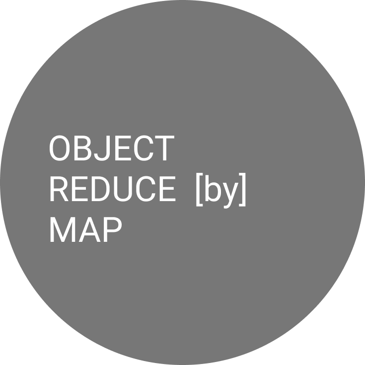

# object-reduce-by-map

Recursively reduce an object to match a given map, plus config options. Perfect for filtering API responses and preventing data leakage.

<!-- START doctoc generated TOC please keep comment here to allow auto update -->
<!-- DON'T EDIT THIS SECTION, INSTEAD RE-RUN doctoc TO UPDATE -->
**Table of Contents**  *generated with [DocToc](https://github.com/thlorenz/doctoc)*

- [Quick Start](#quick-start)
- [Documentation](#documentation)
- [Features](#features)
- [Use Cases](#use-cases)
- [Example use as an API output transformer](#example-use-as-an-api-output-transformer)
- [More Examples](#more-examples)

<!-- END doctoc generated TOC please keep comment here to allow auto update -->

## Quick Start

Install the package:

```bash
npm install object-reduce-by-map
```

Basic usage:

```typescript
import reduceByMap from 'object-reduce-by-map';

const input = { 
  name: 'John', 
  email: 'john@example.com',
  password: 'secret123',  // Will be removed
  internalId: 'xyz'       // Will be removed
};

const map = { 
  name: String, 
  email: String 
};

const output = reduceByMap(input, map);
console.log(output); // { name: 'John', email: 'john@example.com' }
```

## Documentation

- **[Installation & Basic Usage](installation.md)** - Get started with all three input methods
- **[JSON Schema Support](json-schema.md)** - Use JSON Schema objects as input (NEW!)
- **[TypeScript Interface Parsing](typescript-interfaces.md)** - Use TypeScript interfaces as schemas
- **[Configuration Options](configuration.md)** - All available options and their usage
- **[Examples](examples.md)** - Real-world examples and use cases
- **[API Reference](api-reference.md)** - Complete API documentation
- **[Migration Guide](migration-guide.md)** - Upgrading to the latest version
- **[Testing & Distribution](testing.md)** - How the package is tested and built

## Features

✅ **Map-based object reduction** - Define schemas using JavaScript constructors  
✅ **TypeScript interface parsing** - Use TypeScript interfaces directly as schemas  
✅ **Nested object support** - Handle deeply nested structures  
✅ **Array handling** - Process arrays of objects  
✅ **Type validation** - Ensure correct types  
✅ **Flexible options** - Control behavior with various configuration options  
✅ **Zero dependencies** - Core functionality has no dependencies  
✅ **TypeScript support** - Full type definitions included  
✅ **Tiny bundle size** - ~10 KB (core), TypeScript optional

## Use Cases

- **API Response Filtering** - Remove sensitive data before sending responses
- **Data Sanitization** - Ensure only expected fields are present
- **Schema Validation** - Validate and transform data structures
- **Middleware** - Use as Express/Koa middleware for automatic filtering
- **GraphQL** - Filter resolver responses
- **Database Projections** - Define what fields to return from queries

## Example use as an API output transformer

An example use case of this package can be found in the TypeScript openapi-nodegen templates as an output
transformer: [openapi-nodegen-typescript-server](https://github.com/acr-lfr/openapi-nodegen-typescript-server/blob/master/src/http/nodegen/routes/___op.ts.njk#L31)

## More Examples

The most up-to-date examples can always be [found in the tests of this project](https://github.com/j-d-carmichael/object-reduce-by-map/tree/master/__tests__)
